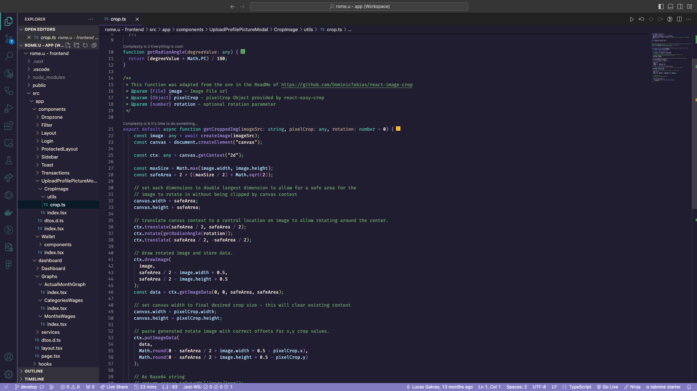

# Linr Theme README

## Description

The theme's proposal is to be a modern dark theme without high contrast colors, designed mostly for people who likes to work at night or with low lights.

## Install
1. Go to VS Code Marketplace.
2. Search for Linr Theme
3. Click on the "Install" button

## Theme Options
* Linr Dark Theme

## Contribute
1. Clone and open this [repo](https://github.com/galvaolucas/linr-vscode-theme) in VS Code;
3. Press F5 to open a new window with your extension loaded
4. Make changes to the /src/themes/linr-color-theme.json file.
5. Once you're happy, commit your changes and open a PR.

## Coming Soon
* Linr Light Theme

**Enjoy!**

## Contributors
* [Lucas Galvão](https://github.com/galvaolucas/)

